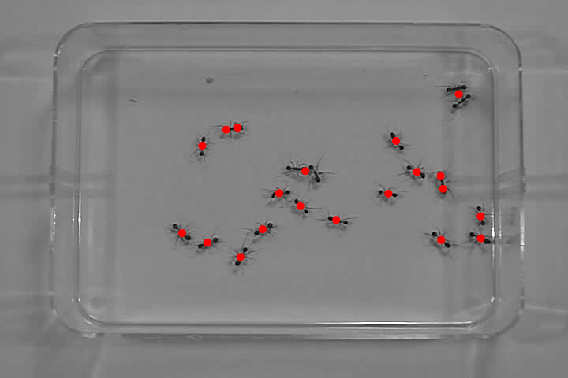
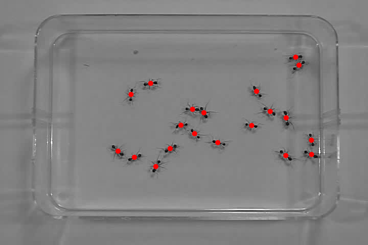

# Simulating Ant Movement

## Similar Size K Means Clustering Algorithm

In order to find the ant locations in each frame, I clustered on points of certain grey intensities. I found that the K Means algorithm often produced clusters with centers that did not correspond to apparent ant locations. I imagine that this is a result of the nature of the initialization of the starting k points, where depending on the proximity of the closest points to dense groupings of ants, it could be that the cluster centers converge with multiple ants in one cluster.

There is a known Same Size K Means algorithm that works to combat this already, but this would not work for me. The 20 ants each have different amount of pixels that they consume in each photo and searching for clusters of the same size wouldn't produce the results that I wanted. This algorithm isn't native to Scala and I didn't end up implementing it, so I am not able to compare it in application.

This led me to developing a [Similar Size K Means](https://github.com/eherbert/SimulatingAntMovement/blob/master/src/main/scala/utility/SimilarSizeKMeans.scala) clustering algorithm. It works by running a normal K Means and then checking to see if the clusters are evenly weighted. If they are, it returns the cluster centers. If they are not, it moves the cluster centers from the smallest sized clusters to random points from the largest sized clusters, effectively splitting them. You pass the algorithm a stdDevBreakpoint and a stdDevTolerance where the clusters are deemed evenly weighted if the standard deviation is below the stdDevBreakpoint and where, if they are not evenly weighted, the clusters larger than the average cluster size + standard deviation * stdDevTolerance are targeted for splitting. Normal K Means is run again and this process repeats until the converged cluster centers from the K Means algorithm are evenly weighted.

Here are the results of K Means compared to results of Similar Size K Means, red dots represent found cluster centers.

K Means:

Similar Size K Means:

There are quite a few things that need improving with this algorithm though. Firstly, it is very slow and gets even slower the more clusters you run it with. Secondly, occasionally clusters will get abandoned such that no points are closest to a cluster center and that cluster is lost. I imagine this happens when there are two large clusters next to one another and the random data points selected to split them are such that all the data points in the two clusters are then closest to one of the two's original centers and the two new random centers. I could have fixed this by manually checking that there were the same number of clusters each run, but I didn't really want to do that.

It would be interesting to write a version of this were instead of moving the centers of the smallest clusters it moved the centers of the smaller of two clusters that were the two closests clusters together. I think that this would produce better results, as I can see a case where one ant is very small and it is always considered the smallest cluster, even when one ant is in two clusters elsewhere. 